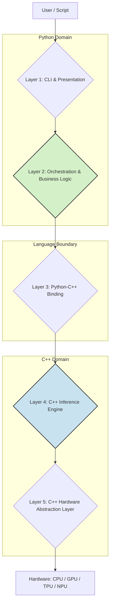
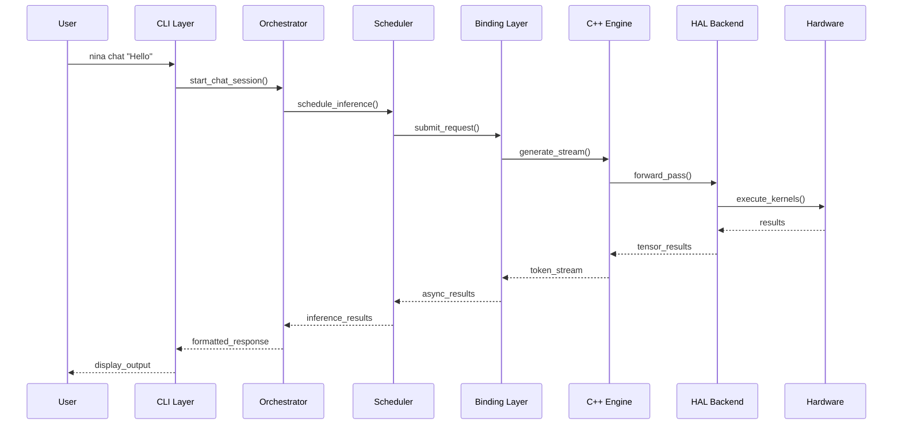

# NINA Project - Comprehensive System Architecture Instructions

**Version:** 2.0  
**Last Updated:** June 30, 2025  
**Status:** Authoritative - Single Source of Truth

## Table of Contents
1. [Primary Directive & Core Tenets](#primary-directive--core-tenets)
2. [Architectural Principles](#architectural-principles)
3. [The NINA Layered Architecture](#the-nina-layered-architecture)
4. [Component Specifications](#component-specifications)
5. [Key Architectural Patterns](#key-architectural-patterns)
6. [Data Flow & Communication Protocols](#data-flow--communication-protocols)
7. [Error Handling & Resilience](#error-handling--resilience)
8. [Performance & Optimization Guidelines](#performance--optimization-guidelines)
9. [Security Architecture](#security-architecture)
10. [Testing Strategy](#testing-strategy)
11. [Deployment & Operations](#deployment--operations)
12. [Development Guidelines](#development-guidelines)
13. [Architecture Decision Records](#architecture-decision-records)
14. [Configuration Management](#configuration-management)
15. [Extensibility: The Plugin System](#extensibility-the-plugin-system)

## Primary Directive & Core Tenets

**Primary Directive:** This document is the single source of truth for the architectural design of NINA. All code, regardless of the language, MUST adhere to the principles, layers, and boundaries defined herein. Deviation from this architecture requires a formal design review and approval through the ADR (Architecture Decision Record) process.

### Core Tenets
1. **Nonstop Autonomy**: The system must operate continuously without human intervention, gracefully handling failures and automatically recovering.
2. **Universal Hardware Compatibility**: Support for any hardware configuration from edge devices to high-end servers with GPUs.
3. **Developer-First Experience**: Clean APIs, comprehensive documentation, and intuitive interfaces for both end-users and developers.

These tenets are achieved through:
- **Strict Layering**: Clear separation of concerns with well-defined interfaces
- **Dependency Inversion**: High-level modules depend on abstractions, not concretions
- **Hardware Abstraction**: Platform-agnostic core with hardware-specific implementations
- **Fail-Safe Design**: Graceful degradation and automatic recovery mechanisms

## Architectural Principles

### 1. Layered Architecture
The system is divided into distinct, hierarchical layers with strict communication rules:

- **Downward Communication Only**: A layer MUST only communicate with the layer directly below it through well-defined interfaces
- **No Layer Bypassing**: Layers MUST NOT bypass intermediate layers to communicate with lower-level layers
- **Interface Contracts**: Each layer interface MUST have a formal contract defining inputs, outputs, and behavior
- **Layer Independence**: Each layer MUST be independently testable and replaceable

**Violation Example**: CLI Layer directly calling C++ Engine functions
**Correct Example**: CLI Layer → Orchestration Layer → Binding Layer → C++ Engine

### 2. Separation of Concerns (SoC)
Each component, class, or module MUST have a single, well-defined responsibility:

- **Single Responsibility**: One class/module = one reason to change
- **High Cohesion**: Related functionality grouped together
- **Low Coupling**: Minimal dependencies between unrelated components
- **Clear Boundaries**: Explicit interfaces between different concerns

**Domain Separation**:
- **User Interface**: Presentation and user interaction (CLI layer)
- **Business Logic**: Application rules and workflows (Orchestration layer)
- **Data Processing**: Computational operations (Engine layer)
- **Hardware Access**: Platform-specific operations (HAL layer)

### 3. Dependency Inversion Principle (DIP)
High-level modules MUST NOT depend on low-level modules. Both MUST depend on abstractions:

- **Abstract Interfaces**: Define contracts, not implementations
- **Dependency Injection**: Inject dependencies rather than creating them
- **Factory Patterns**: Use factories for creating complex objects
- **Configuration-Driven**: Use configuration to wire dependencies

**Benefits**:
- **Testability**: Easy to mock dependencies for unit testing
- **Flexibility**: Swap implementations without changing client code
- **Hardware Agnostic**: Same high-level code works across different hardware

### 4. Interface-Driven Design
All major components MUST interact through stable, abstract interfaces:

- **Contract-First**: Design interfaces before implementations
- **Versioning**: Interface changes require version management
- **Backward Compatibility**: Maintain compatibility across versions
- **Documentation**: Comprehensive interface documentation required

**Interface Categories**:
- **Service Interfaces**: Business logic operations
- **Repository Interfaces**: Data access patterns
- **Hardware Interfaces**: Platform abstraction
- **Plugin Interfaces**: Extension points

### 5. CLI-First, API-Ready Architecture
The system prioritizes CLI usage while maintaining programmatic accessibility:

- **CLI as Primary Client**: CLI is the main interface, but not the only one
- **API-First Core**: Core logic accessible via clean programmatic API
- **Uniform Access**: Same functionality available via CLI and API
- **Extensibility**: Easy to add new interfaces (web, gRPC, etc.)

### 6. Stateless Core Logic
Components in Orchestration and Engine layers SHOULD be stateless where possible:

- **Explicit State Passing**: Pass state as method parameters, not member variables
- **Immutable Objects**: Use immutable data structures where possible
- **Pure Functions**: Prefer functions without side effects
- **State Isolation**: Isolate stateful components to specific, well-defined areas

**Benefits**:
- **Concurrency**: Easier parallel execution
- **Testing**: Predictable, repeatable behavior
- **Reasoning**: Simpler mental model for developers
- **Scaling**: Stateless components scale horizontally

### 7. Fail-Safe Design
The system MUST gracefully handle failures and continue operating:

- **Graceful Degradation**: Reduce functionality rather than complete failure
- **Circuit Breakers**: Prevent cascade failures
- **Retry Logic**: Automatic retry with exponential backoff
- **Fallback Mechanisms**: Alternative execution paths for failures

### 8. Observable Systems
All components MUST provide comprehensive observability:

- **Structured Logging**: Consistent, machine-readable log format
- **Metrics Collection**: Performance and health metrics
- **Tracing**: Request flow tracking across layers
- **Health Checks**: Component health reporting

## The NINA Layered Architecture

The system is composed of five primary layers, forming a clean hierarchy from user interaction down to bare metal. Each layer has specific responsibilities, technologies, and strict rules governing its behavior.



### Layer 1: CLI & Presentation Layer (Python)

**Primary Responsibility**: All direct user interaction and presentation logic.

**Technologies**: 
- **CLI Framework**: `typer` (preferred) or `click`
- **Output Formatting**: `rich` for enhanced terminal output
- **Configuration**: `pydantic-settings` for CLI configuration
- **Session Management**: In-memory session state for interactive commands

**Key Components**:
- `CLIApplication`: Main application entry point
- `CommandHandlers`: Individual command implementations
- `OutputFormatters`: Different output format handlers (JSON, table, etc.)
- `SessionManager`: Manages interactive session state
- `ProgressDisplays`: Progress bars and status indicators

**Architecture Rules**:

1. **Zero Business Logic**: This layer MUST contain no business logic whatsoever
   - Command parsing and validation only
   - User input collection and sanitization
   - Output formatting and display

2. **Orchestration Delegation**: All actions MUST be delegated to the Orchestration Layer
   ```python
   # GOOD: Delegate to orchestration
   @app.command()
   async def chat(model: str = "llama3"):
       orchestrator = get_orchestrator()
       session = await orchestrator.start_chat_session(model_id=model)
       # Handle user interaction loop
   
   # BAD: Business logic in CLI
   @app.command()
   async def chat(model: str = "llama3"):
       # DON'T DO THIS - business logic belongs in orchestration
       if model not in SUPPORTED_MODELS:
           download_model(model)
   ```

3. **No Direct Hardware/Engine Access**: MUST NOT interact with C++ binding or hardware layers

4. **User-Facing State Only**: Handle only presentation state (command history, display preferences)

5. **Error Translation**: Convert technical errors to user-friendly messages
   ```python
   try:
       result = await orchestrator.execute_inference(request)
   except ModelNotFoundError as e:
       console.print(f"[red]Model '{e.model_id}' not found. Use 'nina models list' to see available models.[/red]")
   except InferenceTimeoutError as e:
       console.print(f"[yellow]Inference timed out after {e.timeout}s. Try reducing batch size.[/yellow]")
   ```

**Implementation Standards**:
- Use dependency injection for orchestrator access
- Implement proper error handling with user-friendly messages
- Support multiple output formats (JSON, YAML, table, plain text)
- Provide comprehensive help and examples
- Implement command completion and suggestions

### Layer 2: Orchestration & Business Logic Layer (Python)

**Primary Responsibility**: The "brain" of NINA - coordinates all complex tasks and implements business logic.

**Technologies**:
- **Async Framework**: `asyncio` for all I/O operations
- **HTTP Client**: `aiohttp` for API communications
- **Configuration**: `pydantic` for strong typing
- **Task Queue**: `asyncio.Queue` for request scheduling
- **Caching**: `diskcache` for persistent caching

**Key Components**:

1. **NINAOrchestrator**: Central coordination hub
   ```python
   class NINAOrchestrator:
       def __init__(
           self,
           model_manager: ModelManager,
           hardware_detector: HardwareDetector,
           inference_scheduler: InferenceScheduler,
           plugin_manager: PluginManager,
           config: NINAConfig
       ):
           # Dependency injection - all dependencies provided
   ```

2. **ModelManager**: Model lifecycle management
   - Model discovery and downloading
   - Model caching and storage
   - Model metadata management
   - Model format conversion and optimization

3. **HardwareDetector**: System capability detection
   - Available hardware enumeration
   - Performance benchmarking
   - Capability assessment
   - Resource monitoring

4. **InferenceScheduler**: Request routing and optimization
   - Local vs. cloud routing decisions
   - Hardware assignment optimization
   - Batch processing coordination
   - Performance optimization

5. **PluginManager**: Extension system management
   - Plugin discovery and loading
   - Plugin lifecycle management
   - Plugin API exposure
   - Security sandboxing

6. **ConfigManager**: Configuration management
   - Configuration loading and validation
   - Environment-specific configurations
   - Dynamic configuration updates
   - Configuration schema management

**Architecture Rules**:

1. **Fully Asynchronous**: ALL I/O operations MUST be non-blocking using `asyncio`
   ```python
   # GOOD: Async I/O
   async def download_model(self, model_id: str) -> ModelInfo:
       async with aiohttp.ClientSession() as session:
           async with session.get(model_url) as response:
               # Process response asynchronously
   
   # BAD: Blocking I/O
   def download_model(self, model_id: str) -> ModelInfo:
       response = requests.get(model_url)  # Blocks entire event loop
   ```

2. **C++ Engine Interaction**: Only through the Python-C++ Binding Layer
   - No direct C++ type knowledge
   - Use Pythonic interfaces only
   - Handle all C++ exceptions at binding layer

3. **Configuration Injection**: All configuration MUST be injected via dependency injection
   ```python
   # GOOD: Configuration injected
   class ModelManager:
       def __init__(self, config: ModelConfig, cache_dir: Path):
           self._config = config
           self._cache_dir = cache_dir
   
   # BAD: Global configuration access
   class ModelManager:
       def __init__(self):
           self._config = get_global_config()  # Tight coupling
   ```

4. **Hybrid Intelligence**: Implement smart local vs. cloud routing
   - Performance-based routing decisions
   - Cost optimization
   - Availability fallbacks
   - Quality of service requirements

5. **State Management**: Manage application state explicitly
   - Session state for conversations
   - Model loading state
   - Hardware availability state
   - Configuration state

**Error Handling Requirements**:
- Comprehensive exception hierarchy
- Automatic retry logic with exponential backoff
- Circuit breaker pattern for external services
- Graceful degradation on component failures

### Layer 3: Python-C++ Binding Layer

**Primary Responsibility**: High-performance, zero-copy translation between Python and C++ domains.

**Technologies**:
- **Binding Framework**: `pybind11` (primary), `nanobind` (future consideration)
- **Memory Management**: Python buffer protocol, NumPy C API
- **Type Mapping**: Custom type converters for complex C++ types

**Key Components**:
- `nina_core.so`: Main shared library
- `TypeConverters`: Python ↔ C++ type translation
- `ExceptionMappers`: C++ → Python exception translation
- `MemoryManagers`: Zero-copy tensor operations
- `ThreadingAdapters`: GIL management and threading

**Architecture Rules**:

1. **No Business Logic**: Pure translation layer only
   ```cpp
   // GOOD: Pure translation
   py::class_<InferenceEngine>(m, "InferenceEngine")
       .def("generate", &InferenceEngine::generate,
            py::call_guard<py::gil_scoped_release>());
   
   // BAD: Business logic in binding
   py::class_<InferenceEngine>(m, "InferenceEngine")
       .def("generate", [](InferenceEngine& engine, const std::string& prompt) {
           // DON'T DO THIS - validation belongs in orchestration
           if (prompt.empty()) {
               throw std::invalid_argument("Prompt cannot be empty");
           }
           return engine.generate(prompt);
       });
   ```

2. **Efficient Type Translation**: Use most efficient conversion methods
   ```cpp
   // GOOD: Zero-copy tensor conversion
   py::class_<Tensor>(m, "Tensor")
       .def_buffer([](Tensor &t) -> py::buffer_info {
           return py::buffer_info(
               t.data(),          // Pointer to buffer
               sizeof(float),     // Size of one element
               py::format_descriptor<float>::format(),
               t.ndim(),          // Number of dimensions
               t.shape(),         // Buffer dimensions
               t.strides()        // Strides
           );
       });
   ```

3. **Exception Translation**: Map C++ exceptions to Python hierarchy
   ```cpp
   py::register_exception<nina::ModelLoadError>(m, "ModelLoadError");
   py::register_exception<nina::InferenceError>(m, "InferenceError");
   py::register_exception<nina::HardwareError>(m, "HardwareError");
   ```

4. **GIL Management**: Release GIL for all long-running operations
   ```cpp
   .def("long_running_operation", &Class::operation,
        py::call_guard<py::gil_scoped_release>())
   ```

5. **Memory Safety**: Ensure proper lifetime management
   - Use `std::shared_ptr` for shared ownership
   - Implement proper Python object lifetime tracking
   - Handle circular references appropriately

### Layer 4: C++ Inference Engine

**Primary Responsibility**: High-performance computational core for AI inference.

**Technologies**:
- **Language**: C++17 (minimum), C++20 (preferred)
- **Build System**: CMake 3.20+
- **Testing**: Google Test + Google Benchmark
- **Memory Management**: Smart pointers, custom allocators
- **Concurrency**: `std::thread`, `std::async`, thread pools

**Key Components**:

1. **InferenceEngine**: Main inference coordinator
   ```cpp
   class InferenceEngine {
   public:
       explicit InferenceEngine(std::unique_ptr<Backend> backend);
       
       // Streaming inference
       std::unique_ptr<TokenStream> GenerateStream(const InferenceRequest& request);
       
       // Batch inference
       std::vector<InferenceResult> GenerateBatch(const std::vector<InferenceRequest>& requests);
       
   private:
       std::unique_ptr<Backend> backend_;
       std::unique_ptr<KVCacheManager> cache_manager_;
       std::unique_ptr<BatchProcessor> batch_processor_;
   };
   ```

2. **Model**: Model representation and management
   ```cpp
   class Model {
   public:
       static std::unique_ptr<Model> LoadFromPath(const std::filesystem::path& path, const Backend& backend);
       
       ModelInfo GetInfo() const;
       TensorView GetWeights(const std::string& layer_name) const;
       void Quantize(QuantizationType type);
       
   private:
       ModelArchitecture architecture_;
       std::unordered_map<std::string, Tensor> weights_;
       QuantizationConfig quantization_;
   };
   ```

3. **Tensor**: Multi-dimensional array with hardware abstraction
   ```cpp
   class Tensor {
   public:
       Tensor(const Shape& shape, DataType dtype, const Backend& backend);
       
       // Data access
       void* data() { return data_; }
       const void* data() const { return data_; }
       
       // Operations (delegated to backend)
       Tensor MatMul(const Tensor& other) const;
       Tensor Softmax(int axis = -1) const;
       Tensor LayerNorm(const Tensor& weight, const Tensor& bias, float eps = 1e-5) const;
       
   private:
       Shape shape_;
       DataType dtype_;
       void* data_;
       const Backend* backend_;
   };
   ```

4. **KVCacheManager**: Key-Value cache optimization
   ```cpp
   class KVCacheManager {
   public:
       struct CacheEntry {
           Tensor key_cache;
           Tensor value_cache;
           size_t sequence_length;
           std::chrono::time_point<std::chrono::steady_clock> last_access;
       };
       
       CacheHandle AllocateCache(const std::string& session_id, size_t max_sequence_length);
       void UpdateCache(CacheHandle handle, const Tensor& keys, const Tensor& values);
       std::optional<CacheEntry> GetCache(CacheHandle handle);
       void EvictOldest();
       
   private:
       std::unordered_map<CacheHandle, CacheEntry> cache_entries_;
       std::mutex cache_mutex_;
       size_t max_cache_size_;
   };
   ```

**Architecture Rules**:

1. **Hardware Agnostic**: NO hardware-specific code in this layer
   ```cpp
   // GOOD: Hardware abstraction
   class InferenceEngine {
       void Forward(const Tensor& input) {
           auto output = backend_->MatMul(input, weights_);  // Delegated to HAL
       }
   };
   
   // BAD: Hardware-specific code
   class InferenceEngine {
       void Forward(const Tensor& input) {
   #ifdef CUDA_AVAILABLE
           cuda_kernel_launch(...);  // Direct hardware access - FORBIDDEN
   #endif
       }
   };
   ```

2. **Standalone Library**: Must be buildable and testable independently
   - No Python dependencies
   - Self-contained build system
   - Comprehensive test suite
   - Benchmarking suite

3. **Memory Efficiency**: Optimal memory usage patterns
   - Pool allocators for frequent allocations
   - In-place operations where possible
   - Memory reuse for temporary tensors
   - Automatic garbage collection of unused tensors

4. **Thread Safety**: Safe concurrent access
   - Immutable data structures where possible
   - Proper synchronization for mutable state
   - Lock-free data structures for hot paths
   - Thread-local storage for per-thread state

5. **Performance Critical**: Optimized for inference performance
   - Minimal dynamic allocations in hot paths
   - Efficient algorithms and data structures
   - Profile-guided optimization support
   - Benchmark-driven development

### Layer 5: C++ Hardware Abstraction Layer (HAL)

**Primary Responsibility**: Abstract hardware-specific APIs into uniform interfaces.

**Technologies**:
- **CPU**: AVX, AVX2, AVX-512, NEON SIMD intrinsics
- **NVIDIA GPU**: CUDA, cuBLAS, cuDNN, TensorRT
- **AMD GPU**: ROCm, hipBLAS, MIOpen
- **Apple Silicon**: Metal, Metal Performance Shaders
- **Intel GPU**: SYCL, oneDNN
- **Neural Processors**: OpenVINO, TensorFlow Lite

**Key Components**:

1. **Backend Interface**: Core abstraction
   ```cpp
   class Backend {
   public:
       virtual ~Backend() = default;
       
       // Device management
       virtual DeviceInfo GetDeviceInfo() const = 0;
       virtual void SetDevice(int device_id) = 0;
       virtual void SynchronizeDevice() = 0;
       
       // Memory management
       virtual void* AllocateMemory(size_t bytes) = 0;
       virtual void DeallocateMemory(void* ptr) = 0;
       virtual void CopyMemory(void* dst, const void* src, size_t bytes, MemoryTransferType type) = 0;
       
       // Tensor operations
       virtual void MatMul(const Tensor& a, const Tensor& b, Tensor& result) = 0;
       virtual void Softmax(const Tensor& input, Tensor& output, int axis) = 0;
       virtual void LayerNorm(const Tensor& input, const Tensor& weight, const Tensor& bias, Tensor& output, float eps) = 0;
       virtual void Attention(const Tensor& query, const Tensor& key, const Tensor& value, Tensor& output, const AttentionParams& params) = 0;
       
       // Model-specific operations
       virtual void Embedding(const Tensor& indices, const Tensor& weights, Tensor& output) = 0;
       virtual void PositionalEncoding(Tensor& tensor, int sequence_length, int model_dim) = 0;
       
   protected:
       Backend() = default;
   };
   ```

2. **BackendFactory**: Hardware detection and instantiation
   ```cpp
   class BackendFactory {
   public:
       static std::vector<std::unique_ptr<Backend>> CreateAllAvailable();
       static std::unique_ptr<Backend> CreateBest();
       static std::unique_ptr<Backend> CreateByType(BackendType type);
       
       // Hardware detection
       static std::vector<HardwareInfo> DetectHardware();
       static bool IsBackendAvailable(BackendType type);
       
   private:
       static std::unique_ptr<Backend> CreateCPUBackend();
   #ifdef NINA_ENABLE_CUDA
       static std::unique_ptr<Backend> CreateCUDABackend();
   #endif
   #ifdef NINA_ENABLE_ROCM
       static std::unique_ptr<Backend> CreateROCmBackend();
   #endif
   #ifdef NINA_ENABLE_METAL
       static std::unique_ptr<Backend> CreateMetalBackend();
   #endif
   };
   ```

3. **Concrete Backend Implementations**:
   
   **CPU Backend**:
   ```cpp
   class CPUBackend : public Backend {
   public:
       explicit CPUBackend(const CPUConfig& config);
       
       void MatMul(const Tensor& a, const Tensor& b, Tensor& result) override {
           // Use optimized BLAS library (OpenBLAS, Intel MKL, etc.)
           cblas_sgemm(CblasRowMajor, CblasNoTrans, CblasNoTrans,
                      m, n, k, 1.0f, a.data<float>(), k,
                      b.data<float>(), n, 0.0f, result.data<float>(), n);
       }
       
   private:
       int num_threads_;
       bool use_avx512_;
   };
   ```
   
   **CUDA Backend**:
   ```cpp
   class CUDABackend : public Backend {
   public:
       explicit CUDABackend(int device_id);
       
       void MatMul(const Tensor& a, const Tensor& b, Tensor& result) override {
           const float alpha = 1.0f, beta = 0.0f;
           cublasSgemm(cublas_handle_, CUBLAS_OP_N, CUBLAS_OP_N,
                      m, n, k, &alpha,
                      a.data<float>(), m,
                      b.data<float>(), k,
                      &beta, result.data<float>(), m);
       }
       
   private:
       cublasHandle_t cublas_handle_;
       cudaStream_t cuda_stream_;
   };
   ```

**Architecture Rules**:

1. **Pure Abstract Interfaces**: All hardware interaction through abstract interfaces
   ```cpp
   // GOOD: Abstract interface
   virtual void Convolution2D(const Tensor& input, const Tensor& kernel, Tensor& output) = 0;
   
   // BAD: Exposing implementation details
   cublasHandle_t GetCublasHandle();  // Exposes CUDA-specific details
   ```

2. **Conditional Compilation**: Use feature flags for optional backends
   ```cpp
   #ifdef NINA_ENABLE_CUDA
   namespace cuda {
       class CUDABackend : public Backend { /* ... */ };
   }
   #endif
   
   std::unique_ptr<Backend> BackendFactory::CreateCUDABackend() {
   #ifdef NINA_ENABLE_CUDA
       return std::make_unique<cuda::CUDABackend>();
   #else
       throw UnsupportedBackendError("CUDA support not compiled");
   #endif
   }
   ```

3. **Runtime Hardware Detection**: Detect capabilities at runtime
   ```cpp
   bool BackendFactory::IsBackendAvailable(BackendType type) {
       switch (type) {
           case BackendType::CUDA:
               return cuda::IsAvailable() && cuda::GetDeviceCount() > 0;
           case BackendType::ROCm:
               return rocm::IsAvailable() && rocm::GetDeviceCount() > 0;
           default:
               return false;
       }
   }
   ```

4. **Performance Optimization**: Backend-specific optimizations
   - Kernel fusion where supported
   - Memory coalescing optimization
   - Asynchronous execution
   - Multi-stream processing

5. **Error Handling**: Uniform error reporting across backends
   ```cpp
   class BackendError : public std::runtime_error {
   public:
       BackendError(BackendType backend, const std::string& message)
           : std::runtime_error(FormatMessage(backend, message))
           , backend_type_(backend) {}
           
       BackendType GetBackendType() const { return backend_type_; }
       
   private:
       BackendType backend_type_;
   };
   ```

## Component Specifications

### Core Python Components

#### NINAOrchestrator
**Location**: `src/nina/orchestration/orchestrator.py`

```python
class NINAOrchestrator:
    """Central coordination hub for all NINA operations."""
    
    def __init__(
        self,
        model_manager: ModelManager,
        hardware_detector: HardwareDetector,
        inference_scheduler: InferenceScheduler,
        plugin_manager: PluginManager,
        config: NINAConfig
    ):
        self._model_manager = model_manager
        self._hardware_detector = hardware_detector
        self._inference_scheduler = inference_scheduler
        self._plugin_manager = plugin_manager
        self._config = config
        self._sessions: Dict[str, ChatSession] = {}
    
    async def start_chat_session(self, model_id: str, **kwargs) -> ChatSession:
        """Start a new chat session with the specified model."""
        
    async def execute_inference(self, request: InferenceRequest) -> InferenceResult:
        """Execute a single inference request."""
        
    async def batch_inference(self, requests: List[InferenceRequest]) -> List[InferenceResult]:
        """Execute multiple inference requests efficiently."""
        
    async def get_available_models(self) -> List[ModelInfo]:
        """Get list of all available models."""
        
    async def download_model(self, model_id: str, progress_callback: Optional[Callable] = None) -> ModelInfo:
        """Download and cache a model."""
```

#### ModelManager
**Location**: `src/nina/orchestration/model_manager.py`

**Responsibilities**:
- Model discovery from multiple sources (Hugging Face, local files, custom repositories)
- Model downloading with progress tracking and resumption
- Model caching and storage management
- Model format conversion and optimization
- Model metadata management and versioning

```python
class ModelManager:
    """Manages model lifecycle from discovery to loading."""
    
    async def ensure_model_available(self, model_id: str) -> ModelInfo:
        """Ensure model is available locally, downloading if necessary."""
        
    async def download_model(self, model_id: str, source: ModelSource) -> ModelInfo:
        """Download model from specified source."""
        
    async def list_cached_models(self) -> List[ModelInfo]:
        """List all locally cached models."""
        
    async def optimize_model(self, model_id: str, optimization_config: OptimizationConfig) -> ModelInfo:
        """Apply optimizations (quantization, pruning, etc.) to a model."""
        
    async def cleanup_cache(self, max_size: Optional[int] = None) -> CacheCleanupResult:
        """Clean up model cache based on usage and size constraints."""
```

#### InferenceScheduler
**Location**: `src/nina/orchestration/inference_scheduler.py`

**Responsibilities**:
- Request routing (local vs. cloud)
- Hardware optimization and assignment
- Batch processing coordination
- Load balancing across multiple devices
- Performance monitoring and optimization

```python
class InferenceScheduler:
    """Intelligent request routing and optimization."""
    
    async def submit_request(self, request: InferenceRequest) -> InferenceResult:
        """Submit inference request for processing."""
        
    async def submit_batch(self, requests: List[InferenceRequest]) -> List[InferenceResult]:
        """Submit batch of requests for optimized processing."""
        
    def should_use_local(self, request: InferenceRequest) -> bool:
        """Decide whether to process request locally or route to cloud."""
        
    def select_optimal_device(self, model_info: ModelInfo, request: InferenceRequest) -> DeviceInfo:
        """Select the best available device for the request."""
```

### Core C++ Components

#### InferenceEngine
**Location**: `src/nina/cpp/engine/inference_engine.hpp`

**Responsibilities**:
- Core inference execution
- Token generation and sampling
- KV cache management
- Batch processing coordination
- Memory management

```cpp
class InferenceEngine {
public:
    explicit InferenceEngine(std::unique_ptr<Backend> backend);
    ~InferenceEngine();
    
    // Model management
    void LoadModel(const std::string& model_path);
    void UnloadModel();
    bool IsModelLoaded() const;
    ModelInfo GetModelInfo() const;
    
    // Inference operations
    std::unique_ptr<TokenStream> GenerateStream(const InferenceRequest& request);
    InferenceResult Generate(const InferenceRequest& request);
    std::vector<InferenceResult> GenerateBatch(const std::vector<InferenceRequest>& requests);
    
    // Configuration
    void SetSamplingParams(const SamplingParams& params);
    void SetBatchSize(size_t batch_size);
    
private:
    std::unique_ptr<Backend> backend_;
    std::unique_ptr<Model> model_;
    std::unique_ptr<KVCacheManager> cache_manager_;
    std::unique_ptr<BatchProcessor> batch_processor_;
    SamplingParams sampling_params_;
};
```

#### Model
**Location**: `src/nina/cpp/model/model.hpp`

**Responsibilities**:
- Model weight storage and management
- Model architecture representation
- Quantization and optimization support
- Memory efficient loading

```cpp
class Model {
public:
    static std::unique_ptr<Model> LoadFromFile(const std::string& path, const Backend& backend);
    static std::unique_ptr<Model> LoadFromMemory(const void* data, size_t size, const Backend& backend);
    
    // Model information
    const ModelArchitecture& GetArchitecture() const;
    const ModelConfig& GetConfig() const;
    size_t GetParameterCount() const;
    size_t GetMemoryUsage() const;
    
    // Layer access
    const std::vector<std::unique_ptr<Layer>>& GetLayers() const;
    Layer* GetLayer(const std::string& name) const;
    
    // Quantization
    void Quantize(QuantizationType type, const QuantizationConfig& config);
    bool IsQuantized() const;
    
private:
    ModelArchitecture architecture_;
    ModelConfig config_;
    std::vector<std::unique_ptr<Layer>> layers_;
    std::unordered_map<std::string, size_t> layer_index_;
    QuantizationInfo quantization_info_;
};
````

## Data Flow & Communication Protocols

### Request Flow Architecture



### Data Transfer Objects (DTOs)

**Python DTOs** (using Pydantic):
```python
class InferenceRequest(BaseModel):
    """Request for inference operation."""
    prompt: str = Field(..., description="Input prompt for inference")
    model_id: str = Field(..., description="Model identifier")
    max_tokens: int = Field(default=512, ge=1, le=4096)
    temperature: float = Field(default=0.7, ge=0.0, le=2.0)
    top_p: float = Field(default=0.9, ge=0.0, le=1.0)
    top_k: int = Field(default=50, ge=1)
    session_id: Optional[str] = None
    system_prompt: Optional[str] = None
    
    class Config:
        frozen = True  # Immutable

class InferenceResult(BaseModel):
    """Result from inference operation."""
    generated_text: str
    tokens_generated: int
    inference_time: float
    model_used: str
    finish_reason: FinishReason
    token_timestamps: List[float]
    
    class Config:
        frozen = True
```

**C++ DTOs**:
```cpp
struct InferenceRequest {
    std::string prompt;
    std::string model_id;
    int max_tokens = 512;
    float temperature = 0.7f;
    float top_p = 0.9f;
    int top_k = 50;
    std::optional<std::string> session_id;
    std::optional<std::string> system_prompt;
};

struct InferenceResult {
    std::string generated_text;
    int tokens_generated;
    double inference_time;
    std::string model_used;
    FinishReason finish_reason;
    std::vector<double> token_timestamps;
};
```

### Example Data Flow: `nina chat`

1. **[CLI Layer]** `main.py`: Parses the command `nina chat --model llama3`
2. **[CLI Layer]** Calls `orchestrator.start_chat_session(model_id='llama3')`
3. **[Orchestration Layer]** `NINAOrchestrator`:
   - Calls `self._model_manager.ensure_model_loaded('llama3')`
   - `ModelManager` checks cache. If not present, downloads from Hugging Face
   - Calls the C++ engine (via binding) to load the model onto the best device selected by the `InferenceScheduler`
   - Creates a `ChatSession` object
4. **[CLI Layer]** Enters a loop, prompting the user for input
5. **[CLI Layer]** User enters "Explain quantum computing". CLI calls `chat_session.send_message("Explain quantum computing")`
6. **[Orchestration Layer]** `ChatSession`:
   - Prepares the `InferenceRequest` object containing the prompt and conversation history
   - Calls `self._scheduler.submit(request)`
7. **[Orchestration Layer]** `InferenceScheduler`:
   - Routes the request to the local C++ engine
   - Calls the Python-C++ binding function `engine.stream_generate(request_data)`
8. **[Binding Layer]** `pybind_wrapper.cpp`:
   - Releases the GIL
   - Translates Python `InferenceRequest` to C++ `InferenceRequest`
   - Calls `cpp_engine->StreamGenerate(cpp_request)`
9. **[C++ Engine & HAL]** The engine executes the inference loop, generating tokens one by one using the appropriate HAL backend. Each generated token is pushed back to the Python layer through a callback or asynchronous generator
10. **[All Layers]** The token streams back up the call stack, finally being printed to the console by the **[CLI Layer]**

### Inter-Layer Communication Rules

1. **Synchronous vs Asynchronous**:
   - CLI ↔ Orchestration: Synchronous with async/await
   - Orchestration ↔ Binding: Asynchronous with callbacks
   - Binding ↔ C++ Engine: Synchronous (GIL released)
   - C++ Engine ↔ HAL: Synchronous

2. **Data Serialization**:
   - Python layers: Pydantic models with JSON serialization
   - C++ layers: Protocol Buffers or custom binary serialization
   - Cross-language: pybind11 automatic type conversion

3. **Error Propagation**:
   - C++ exceptions → Python exceptions (via binding layer)
   - Python exceptions bubble up through layers
   - User-friendly error messages at CLI layer

## Configuration Management

Configuration MUST be loaded once at application startup into a strongly-typed configuration object (e.g., using Pydantic in Python). This config object is then passed down to components that need it via Dependency Injection. AVOID global configuration variables or accessing config files from deep within the application logic.

**Example Configuration Structure**:
```python
class NINAConfig(BaseModel):
    """Main configuration for NINA application."""
    
    # Model configuration
    model_cache_dir: Path = Field(default_factory=lambda: Path.home() / ".nina" / "models")
    max_model_cache_size: int = Field(default=50_000_000_000)  # 50GB
    
    # Hardware configuration
    preferred_device: Optional[str] = None
    enable_gpu: bool = True
    max_gpu_memory: Optional[float] = None
    
    # Inference configuration
    default_max_tokens: int = 512
    default_temperature: float = 0.7
    batch_size: int = 1
    
    # Network configuration
    download_timeout: float = 300.0
    max_concurrent_downloads: int = 3
    
    # Plugin configuration
    plugin_dirs: List[Path] = Field(default_factory=list)
    enable_plugins: bool = True
    
    # Logging configuration
    log_level: str = "INFO"
    log_file: Optional[Path] = None
```

## Extensibility: The Plugin System

The plugin architecture MUST be managed by the Orchestration Layer with the following requirements:

### Plugin Architecture

1. **PluginManager**: Responsible for discovering plugins in designated directories
2. **Plugin Interface**: Each plugin MUST adhere to a specific abstract base class (e.g., `nina.plugins.ToolPluginBase`)
3. **Security Sandbox**: All plugins execute in a restricted environment
4. **Integration**: The `NINAOrchestrator` uses the `PluginManager` to provide models with access to "tools," enabling RAG and other function-calling capabilities

```python
class ToolPluginBase(ABC):
    """Abstract base class for tool plugins."""
    
    @abstractmethod
    def get_name(self) -> str:
        """Return the plugin name."""
        
    @abstractmethod
    def get_description(self) -> str:
        """Return the plugin description."""
        
    @abstractmethod
    async def execute(self, parameters: Dict[str, Any]) -> Dict[str, Any]:
        """Execute the plugin with given parameters."""
        
    @abstractmethod
    def get_schema(self) -> Dict[str, Any]:
        """Return the JSON schema for plugin parameters."""

class PluginManager:
    """Manages plugin discovery, loading, and execution."""
    
    def __init__(self, plugin_dirs: List[Path], security_config: SecurityConfig):
        self.plugin_dirs = plugin_dirs
        self.security_config = security_config
        self._plugins: Dict[str, ToolPluginBase] = {}
        self._sandbox = PluginSandbox()
    
    async def discover_plugins(self) -> None:
        """Discover and load plugins from configured directories."""
        
    async def execute_plugin(self, plugin_name: str, parameters: Dict[str, Any]) -> Dict[str, Any]:
        """Execute a plugin safely in sandbox."""
        
    def get_available_plugins(self) -> List[str]:
        """Get list of available plugin names."""
```

**Key Points**:
- The core engine does not need to be aware of plugins
- The Orchestrator prepares the prompt with plugin-provided context/tools before sending it to the engine
- Plugins are executed in a secure sandbox environment
- Plugin capabilities are exposed through standardized interfaces

## Development Guidelines

### Code Style & Standards

#### Python Code Standards
- **Style Guide**: Follow PEP 8 with Black formatting
- **Type Hints**: All public APIs must have complete type annotations
- **Documentation**: Comprehensive docstrings in Google format
- **Import Organization**: Use isort with standard library, third-party, and local imports separated

#### C++ Code Standards
- **Style Guide**: Google C++ Style Guide with modifications
- **Header Guards**: Use `#pragma once`
- **Namespace**: All code in `nina` namespace
- **Smart Pointers**: Prefer smart pointers over raw pointers
- **Const Correctness**: Mark methods const where appropriate

### Git Workflow & Branch Management

#### Branch Strategy
- **main**: Production-ready code
- **development**: Integration branch for features
- **feature/***: Individual feature development
- **hotfix/***: Critical bug fixes
- **release/***: Release preparation

#### Commit Message Format
```
type(scope): brief description

Detailed explanation of the change, including:
- What was changed
- Why it was changed
- Any breaking changes

Closes #issue-number
```

Types: `feat`, `fix`, `docs`, `style`, `refactor`, `test`, `chore`

## Architecture Decision Records

### ADR-001: Layered Architecture Choice
**Status**: Accepted
**Date**: 2025-06-30

**Context**: Need clean separation between user interface, business logic, and computational core.

**Decision**: Implement strict 5-layer architecture with clear interfaces.

**Consequences**: 
- Better testability and maintainability
- Slight performance overhead from layer boundaries
- Clear development guidelines and boundaries

### ADR-002: C++ for Inference Engine
**Status**: Accepted  
**Date**: 2025-06-30

**Context**: Need high-performance inference with hardware abstraction.

**Decision**: Use C++17 for inference engine with abstract hardware interfaces.

**Consequences**:
- Optimal performance for inference workloads
- Hardware vendor SDK compatibility
- Additional complexity in build system and development

### ADR-003: pybind11 for Language Binding
**Status**: Accepted
**Date**: 2025-06-30

**Context**: Need efficient Python-C++ interoperability.

**Decision**: Use pybind11 for binding layer with automatic type conversion.

**Consequences**:
- Excellent performance with minimal overhead
- Automatic type conversion reduces boilerplate
- Compile-time dependency and C++ expertise required

---

## Conclusion

This architecture document serves as the definitive guide for NINA's system design. All implementation decisions should align with these principles and patterns. Regular reviews and updates ensure the architecture evolves with the project's needs while maintaining its core integrity.

For questions or proposed changes to this architecture, please:
1. Create an issue for discussion
2. Propose changes via ADR process
3. Ensure all stakeholders review and approve modifications

**Remember**: The architecture is a living document that should evolve thoughtfully with the project's needs while maintaining its core principles of layering, abstraction, and clean separation of concerns.