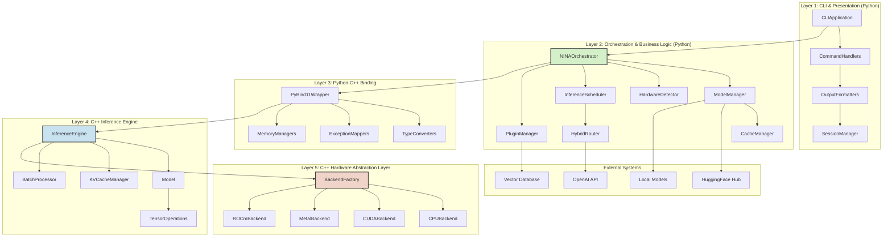

# NINA Project - Core Architecture Design Document

**Status:** Draft  
**Date:** June 30, 2025  
**Version:** 1.0  
**Architect:** AI System Architect  

---

## Phase 1: Problem Definition & Vision Alignment

### 1.1. Articulate the Problem

**The "Why":**
The current landscape of LLM inference faces several critical challenges:

1. **High Cloud Costs:** Organizations spend $500-2000/month on cloud API fees for production LLM workloads
2. **Data Sovereignty Concerns:** Sensitive data must be transmitted to external services, violating compliance requirements
3. **Hardware Fragmentation:** No unified solution exists for optimal LLM inference across diverse hardware (CPU, NVIDIA GPU, AMD GPU, Apple Silicon, edge devices)
4. **Deployment Complexity:** Current solutions require deep technical expertise and are platform-specific
5. **Performance Inconsistency:** Existing tools either optimize for specific hardware or provide poor cross-platform performance

**Root Cause Analysis (5 Whys):**

- Why do organizations pay high cloud costs? → They need LLM inference but lack local alternatives
- Why do they lack local alternatives? → Current tools are too complex or hardware-specific
- Why are current tools hardware-specific? → They lack proper hardware abstraction layers
- Why do they lack hardware abstraction? → They're built for specific use cases, not universal deployment
- Why aren't they built universally? → No unified architecture exists that balances performance with accessibility

**Goals:**

- **G1:** Reduce LLM inference costs by 90% (from $500-2000/month to <$50/month amortized hardware costs)
- **G2:** Achieve universal hardware compatibility across ARM, x86, NVIDIA, AMD, Apple Silicon, and edge devices
- **G3:** Deliver CLI-first developer experience with <5 command learning curve
- **G4:** Provide nonstop autonomous operation with 99.9% uptime
- **G5:** Enable hybrid cloud fallback with seamless API compatibility
- **G6:** Achieve performance targets: >1000 tokens/sec on RTX 4090, >100 tokens/sec on Apple M2, >20 tokens/sec on Raspberry Pi 4

**Non-Goals:**

- Building a new language model or training infrastructure
- Creating a graphical user interface (CLI-first approach)
- Implementing a vector database (will integrate with existing solutions)
- Supporting proprietary model formats beyond standard open formats
- Providing managed cloud services (pure local/hybrid solution)

### 1.2. Validate Against the Core Vision (PRD)

**Alignment with PRD Tenets:**

**Universal Hardware Compatibility:**

- ✅ Implements 5-layer architecture with Hardware Abstraction Layer (HAL)
- ✅ Supports CPU (ARM, x86), GPU (NVIDIA, AMD, Apple), and edge devices
- ✅ Dynamic hardware detection and optimal resource allocation
- ✅ Fallback mechanisms ensure operation on any hardware

**Nonstop Autonomous Operation:**

- ✅ Zero-downtime model switching through hot-swapping mechanisms
- ✅ Automatic failover between local and cloud resources
- ✅ Self-healing capabilities with circuit breaker patterns
- ✅ Continuous performance optimization through monitoring

**Hybrid Intelligence Architecture:**

- ✅ Intelligent request routing based on cost, latency, and quality requirements
- ✅ Seamless integration with cloud APIs (OpenAI, Anthropic, etc.)
- ✅ Local-first operation with cloud enhancement capabilities
- ✅ Cost optimization through dynamic resource allocation

**Developer-First Experience:**

- ✅ Intuitive CLI with extensive automation and scripting support
- ✅ Rich Python SDK with async/await patterns and type hints
- ✅ OpenAI-compatible API for drop-in replacement
- ✅ Comprehensive plugin architecture for extensibility

**Trade-offs Justification:**

- **Complexity vs. Performance:** The 5-layer architecture introduces complexity but enables optimal performance across diverse hardware. This trade-off is justified because NINA targets technical users who value performance over simplicity.
- **Memory Overhead vs. Flexibility:** The Python orchestration layer adds ~50MB memory overhead but provides essential flexibility for configuration, monitoring, and integration. This is acceptable given the target hardware (4GB+ RAM minimum).
- **Build Complexity vs. Portability:** Supporting multiple hardware backends increases build complexity but is essential for the universal compatibility goal.

---

## Phase 2: Architectural Design & Layering

### 2.1. High-Level Component Diagram



### 2.2. Detailed Layer-by-Layer Breakdown

#### Layer 1: CLI & Presentation

**New Components:**

```python
class CLIApplication:
    """Main CLI application entry point with typer integration."""
    
    def __init__(self, orchestrator: NINAOrchestrator):
        self.orchestrator = orchestrator
        self.app = typer.Typer(name="nina", help="Neural Inference for Nonstop Autonomy")
        self._setup_commands()
    
    def _setup_commands(self):
        """Register all CLI commands with proper error handling."""
        self.app.command()(self.chat)
        self.app.command()(self.complete)
        self.app.command()(self.serve)
        # ... additional commands

class CommandHandlers:
    """Individual command implementations with rich output formatting."""
    
    async def chat_handler(self, model: str, stream: bool = True) -> None:
        """Handle interactive chat sessions with streaming support."""
        
    async def batch_handler(self, input_file: Path, output_file: Path) -> None:
        """Handle batch processing with progress monitoring."""

class SessionManager:
    """Manages interactive session state and conversation history."""
    
    def __init__(self):
        self.active_sessions: Dict[str, ChatSession] = {}
        self.conversation_history: Dict[str, List[Message]] = {}
```

**CLI Commands Implementation:**

```bash
# Core inference commands
nina chat --model llama-3.1-8b --stream
nina complete "Explain quantum computing" --model gpt-4 --fallback
nina batch --input prompts.jsonl --output results.jsonl --parallel 4

# Model management
nina model download llama-3.1-8b-instruct
nina model list --local --cloud
nina model optimize llama-3.1-8b --quantize 4bit

# Configuration and monitoring
nina config profile create development --model llama-3.1-8b
nina monitor --real-time --export prometheus
nina serve --model mistral-7b --port 8080
```

**Rich Output Integration:**

- Progress bars for model downloads and batch processing
- Real-time token streaming with typing indicators
- Colorized output with syntax highlighting
- Performance metrics display with charts and graphs

#### Layer 2: Orchestration & Business Logic

**Core Components:**

```python
class NINAOrchestrator:
    """Central coordination hub implementing hybrid intelligence routing."""
    
    def __init__(
        self,
        model_manager: ModelManager,
        hardware_detector: HardwareDetector,
        inference_scheduler: InferenceScheduler,
        plugin_manager: PluginManager,
        config: NINAConfig
    ):
        self.model_manager = model_manager
        self.hardware_detector = hardware_detector
        self.inference_scheduler = inference_scheduler
        self.plugin_manager = plugin_manager
        self.config = config
        self.hybrid_router = HybridRouter(config.cloud_config)
        
    async def execute_inference(self, request: InferenceRequest) -> InferenceResult:
        """Execute inference with intelligent local/cloud routing."""
        # Route decision based on model availability, performance, and cost
        route = await self.hybrid_router.determine_route(request)
        
        if route.use_local:
            return await self._execute_local_inference(request)
        else:
            return await self._execute_cloud_inference(request)
    
    async def start_chat_session(self, model_id: str, **kwargs) -> ChatSession:
        """Initialize new chat session with model loading and optimization."""
        # Ensure model is available and optimized
        model_info = await self.model_manager.ensure_model_available(model_id)
        
        # Select optimal hardware configuration
        device = self.inference_scheduler.select_optimal_device(model_info)
        
        # Create session with context management
        session = ChatSession(
            model_id=model_id,
            device=device,
            config=kwargs,
            kv_cache=await self._allocate_kv_cache(model_info)
        )
        
        return session

class ModelManager:
    """Comprehensive model lifecycle management."""
    
    def __init__(self, cache_dir: Path, config: ModelConfig):
        self.cache_dir = cache_dir
        self.config = config
        self.download_client = HuggingFaceClient()
        self.optimizer = ModelOptimizer()
        
    async def ensure_model_available(self, model_id: str) -> ModelInfo:
        """Ensure model is locally available, downloading if necessary."""
        cached_path = self.cache_dir / model_id
        
        if not cached_path.exists():
            await self._download_model(model_id)
            
        # Apply optimizations if not already optimized
        optimized_path = await self._ensure_optimized(model_id)
        
        return ModelInfo.from_path(optimized_path)
    
    async def _download_model(self, model_id: str) -> None:
        """Download model with progress tracking and resumption."""
        async with self.download_client.download_stream(model_id) as stream:
            async for chunk in stream:
                # Write chunk with progress reporting
                await self._write_chunk_with_progress(chunk)

class InferenceScheduler:
    """Intelligent request routing and hardware optimization."""
    
    def __init__(self, hardware_detector: HardwareDetector):
        self.hardware_detector = hardware_detector
        self.device_pool = DevicePool()
        self.performance_monitor = PerformanceMonitor()
        
    async def submit_request(self, request: InferenceRequest) -> InferenceResult:
        """Submit request with optimal device selection and batching."""
        # Select best available device
        device = self.select_optimal_device(request.model_info)
        
        # Queue request for optimal batching
        batch_group = await self._find_optimal_batch(request, device)
        
        # Execute with performance monitoring
        return await self._execute_with_monitoring(batch_group, device)
    
    def select_optimal_device(self, model_info: ModelInfo) -> DeviceInfo:
        """Select optimal device based on model requirements and availability."""
        available_devices = self.hardware_detector.get_available_devices()
        
        # Score devices based on memory, compute, and current load
        scored_devices = []
        for device in available_devices:
            score = self._calculate_device_score(device, model_info)
            scored_devices.append((score, device))
        
        # Return highest scoring available device
        return max(scored_devices, key=lambda x: x[0])[1]

class HybridRouter:
    """Intelligent routing between local and cloud inference."""
    
    def __init__(self, cloud_config: CloudConfig):
        self.cloud_config = cloud_config
        self.cost_calculator = CostCalculator()
        self.quality_assessor = QualityAssessor()
        
    async def determine_route(self, request: InferenceRequest) -> RoutingDecision:
        """Determine optimal routing based on cost, quality, and latency."""
        local_capability = await self._assess_local_capability(request)
        
        if not local_capability.can_handle:
            return RoutingDecision(use_local=False, reason="insufficient_local_resources")
        
        # Cost-benefit analysis
        local_cost = self.cost_calculator.estimate_local_cost(request)
        cloud_cost = self.cost_calculator.estimate_cloud_cost(request)
        
        # Quality requirements analysis
        quality_requirements = request.quality_requirements or QualityRequirements.default()
        
        if quality_requirements.requires_latest_model and not local_capability.has_latest:
            return RoutingDecision(use_local=False, reason="quality_requirements")
        
        # Latency requirements
        if request.latency_requirements and local_capability.estimated_latency > request.latency_requirements.max_latency:
            return RoutingDecision(use_local=False, reason="latency_requirements")
        
        # Default to local for cost optimization
        return RoutingDecision(use_local=True, reason="cost_optimized")
```

**Async Flow and Dependency Injection:**

```python
# Main application entry point with dependency injection
async def create_nina_application() -> CLIApplication:
    """Factory function for creating NINA application with proper DI."""
    
    # Load configuration
    config = NINAConfig.load_from_environment()
    
    # Initialize core services
    hardware_detector = HardwareDetector()
    await hardware_detector.initialize()
    
    model_manager = ModelManager(
        cache_dir=config.model_cache_dir,
        config=config.model_config
    )
    
    inference_scheduler = InferenceScheduler(hardware_detector)
    
    plugin_manager = PluginManager(
        plugin_dirs=config.plugin_dirs,
        security_config=config.security_config
    )
    
    # Create orchestrator with all dependencies
    orchestrator = NINAOrchestrator(
        model_manager=model_manager,
        hardware_detector=hardware_detector,
        inference_scheduler=inference_scheduler,
        plugin_manager=plugin_manager,
        config=config
    )
    
    # Initialize and return CLI application
    cli_app = CLIApplication(orchestrator)
    await cli_app.initialize()
    
    return cli_app

# Async execution points
async def main():
    """Main async entry point with proper error handling."""
    try:
        app = await create_nina_application()
        await app.run()
    except KeyboardInterrupt:
        logger.info("Shutting down gracefully...")
    except Exception as e:
        logger.exception(f"Fatal error: {e}")
        sys.exit(1)
```

#### Layer 3: Python-C++ Binding

**Core Binding Implementation:**

```cpp
// nina_core_bindings.cpp
#include <pybind11/pybind11.h>
#include <pybind11/stl.h>
#include <pybind11/numpy.h>
#include <pybind11/gil.h>

#include "nina/inference_engine.hpp"
#include "nina/model.hpp"
#include "nina/tensor.hpp"

namespace py = pybind11;

// Type converters for efficient data transfer
py::class_<nina::Tensor> bind_tensor(py::module& m) {
    return py::class_<nina::Tensor>(m, "Tensor")
        .def_buffer([](nina::Tensor &t) -> py::buffer_info {
            return py::buffer_info(
                t.data(),                               // Pointer to buffer
                sizeof(float),                          // Size of one scalar
                py::format_descriptor<float>::format(), // Python struct-style format descriptor
                t.ndim(),                              // Number of dimensions
                { t.shape().begin(), t.shape().end() }, // Buffer dimensions
                { t.strides().begin(), t.strides().end() } // Strides (in bytes) for each index
            );
        })
        .def("shape", &nina::Tensor::shape)
        .def("dtype", &nina::Tensor::dtype)
        .def("device", &nina::Tensor::device);
}

// Exception mapping for proper error propagation
void bind_exceptions(py::module& m) {
    py::register_exception<nina::ModelLoadError>(m, "ModelLoadError");
    py::register_exception<nina::InferenceError>(m, "InferenceError");
    py::register_exception<nina::HardwareError>(m, "HardwareError");
    py::register_exception<nina::OutOfMemoryError>(m, "OutOfMemoryError");
}

// Inference engine binding with GIL management
py::class_<nina::InferenceEngine> bind_inference_engine(py::module& m) {
    return py::class_<nina::InferenceEngine>(m, "InferenceEngine")
        .def(py::init<std::unique_ptr<nina::Backend>>())
        .def("load_model", &nina::InferenceEngine::LoadModel,
             py::call_guard<py::gil_scoped_release>(),
             "Load model from file path")
        .def("generate_stream", [](nina::InferenceEngine& engine, const nina::InferenceRequest& request) {
            py::gil_scoped_release release;
            return engine.GenerateStream(request);
        }, "Generate tokens with streaming output")
        .def("get_model_info", &nina::InferenceEngine::GetModelInfo)
        .def("is_model_loaded", &nina::InferenceEngine::IsModelLoaded);
}

// Token stream binding for real-time generation
py::class_<nina::TokenStream> bind_token_stream(py::module& m) {
    return py::class_<nina::TokenStream>(m, "TokenStream")
        .def("__iter__", [](nina::TokenStream &stream) { return py::make_iterator(stream.begin(), stream.end()); },
             py::keep_alive<0, 1>())
        .def("next", [](nina::TokenStream &stream) -> std::optional<nina::Token> {
            py::gil_scoped_release release;
            return stream.next();
        })
        .def("is_done", &nina::TokenStream::is_done)
        .def("get_metadata", &nina::TokenStream::get_metadata);
}

PYBIND11_MODULE(nina_core, m) {
    m.doc() = "NINA Core Inference Engine - High-performance LLM inference";
    
    // Bind exceptions first
    bind_exceptions(m);
    
    // Bind core types
    bind_tensor(m);
    bind_token_stream(m);
    bind_inference_engine(m);
    
    // Bind data structures
    py::class_<nina::InferenceRequest>(m, "InferenceRequest")
        .def(py::init<const std::string&, const std::string&>())
        .def_readwrite("prompt", &nina::InferenceRequest::prompt)
        .def_readwrite("model_id", &nina::InferenceRequest::model_id)
        .def_readwrite("max_tokens", &nina::InferenceRequest::max_tokens)
        .def_readwrite("temperature", &nina::InferenceRequest::temperature);
    
    py::class_<nina::InferenceResult>(m, "InferenceResult")
        .def_readonly("generated_text", &nina::InferenceResult::generated_text)
        .def_readonly("tokens_generated", &nina::InferenceResult::tokens_generated)
        .def_readonly("inference_time", &nina::InferenceResult::inference_time)
        .def_readonly("finish_reason", &nina::InferenceResult::finish_reason);
}
```

**Memory Management and Zero-Copy Operations:**

```python
# Python wrapper with efficient memory management
class NINACoreEngine:
    """Python wrapper for C++ inference engine with memory optimization."""
    
    def __init__(self, backend_type: str = "auto"):
        self._core_engine = nina_core.InferenceEngine(self._create_backend(backend_type))
        self._tensor_pool = TensorPool()  # Reuse tensors to avoid allocations
        
    async def generate_stream(self, request: InferenceRequest) -> AsyncIterator[str]:
        """Generate tokens with zero-copy streaming."""
        # Convert Python request to C++ request (minimal copying)
        cpp_request = self._convert_request(request)
        
        # Get C++ token stream (GIL released in C++)
        cpp_stream = self._core_engine.generate_stream(cpp_request)
        
        # Async iteration over C++ stream
        while not cpp_stream.is_done():
            token = cpp_stream.next()  # GIL released in C++
            if token:
                yield token.text
            await asyncio.sleep(0)  # Yield control to event loop
```

#### Layer 4: C++ Inference Engine

**Core Engine Architecture:**

```cpp
// nina/inference_engine.hpp
#pragma once

#include <memory>
#include <vector>
#include <string>
#include <optional>
#include "nina/model.hpp"
#include "nina/backend.hpp"
#include "nina/tensor.hpp"
#include "nina/kv_cache.hpp"

namespace nina {

class InferenceEngine {
public:
    explicit InferenceEngine(std::unique_ptr<Backend> backend);
    ~InferenceEngine();
    
    // Model management
    void LoadModel(const std::string& model_path);
    void UnloadModel();
    bool IsModelLoaded() const;
    ModelInfo GetModelInfo() const;
    
    // Inference operations
    std::unique_ptr<TokenStream> GenerateStream(const InferenceRequest& request);
    InferenceResult Generate(const InferenceRequest& request);
    std::vector<InferenceResult> GenerateBatch(const std::vector<InferenceRequest>& requests);
    
    // Performance optimization
    void SetSamplingParams(const SamplingParams& params);
    void EnableKVCache(bool enable);
    void SetMaxBatchSize(size_t batch_size);
    
private:
    std::unique_ptr<Backend> backend_;
    std::unique_ptr<Model> model_;
    std::unique_ptr<KVCacheManager> cache_manager_;
    std::unique_ptr<BatchProcessor> batch_processor_;
    SamplingParams sampling_params_;
    
    // Internal inference pipeline
    Tensor ProcessInput(const std::string& prompt);
    std::vector<int32_t> Tokenize(const std::string& text);
    std::string Detokenize(const std::vector<int32_t>& tokens);
    Tensor ForwardPass(const Tensor& input_tokens, const KVCache& cache);
    int32_t SampleNextToken(const Tensor& logits);
};

} // namespace nina
```

**Model Representation:**

```cpp
// nina/model.hpp
#pragma once

#include <memory>
#include <unordered_map>
#include <vector>
#include "nina/tensor.hpp"
#include "nina/backend.hpp"

namespace nina {

enum class ModelArchitecture {
    LLAMA,
    MISTRAL,
    GEMMA,
    FALCON,
    GPT_NEOX
};

struct ModelConfig {
    ModelArchitecture architecture;
    size_t vocab_size;
    size_t hidden_size;
    size_t num_layers;
    size_t num_attention_heads;
    size_t num_key_value_heads;
    size_t intermediate_size;
    size_t max_position_embeddings;
    float rms_norm_eps;
    float rope_theta;
};

class Model {
public:
    static std::unique_ptr<Model> LoadFromFile(const std::string& path, const Backend& backend);
    static std::unique_ptr<Model> LoadFromMemory(const void* data, size_t size, const Backend& backend);
    
    // Model information
    const ModelConfig& GetConfig() const { return config_; }
    size_t GetParameterCount() const;
    size_t GetMemoryUsage() const;
    ModelArchitecture GetArchitecture() const { return config_.architecture; }
    
    // Layer access
    const Tensor& GetEmbedding() const { return embedding_; }
    const std::vector<TransformerLayer>& GetLayers() const { return layers_; }
    const Tensor& GetOutputNorm() const { return output_norm_; }
    const Tensor& GetOutputProjection() const { return output_projection_; }
    
    // Quantization support
    void Quantize(QuantizationType type, const QuantizationConfig& config);
    bool IsQuantized() const { return quantization_info_.has_value(); }
    QuantizationType GetQuantizationType() const;
    
private:
    ModelConfig config_;
    Tensor embedding_;
    std::vector<TransformerLayer> layers_;
    Tensor output_norm_;
    Tensor output_projection_;
    std::optional<QuantizationInfo> quantization_info_;
    
    void InitializeFromGGUF(const std::string& path, const Backend& backend);
    void InitializeFromONNX(const std::string& path, const Backend& backend);
    void InitializeFromSafeTensors(const std::string& path, const Backend& backend);
};

struct TransformerLayer {
    // Attention components
    Tensor attention_norm;
    Tensor query_proj;
    Tensor key_proj;
    Tensor value_proj;
    Tensor output_proj;
    
    // Feed-forward components
    Tensor ffn_norm;
    Tensor gate_proj;
    Tensor up_proj;
    Tensor down_proj;
};

} // namespace nina
```

**KV Cache Management:**

```cpp
// nina/kv_cache.hpp
#pragma once

#include <memory>
#include <unordered_map>
#include <mutex>
#include <chrono>
#include "nina/tensor.hpp"

namespace nina {

using CacheHandle = size_t;

struct KVCache {
    Tensor key_cache;    // [num_layers, max_seq_len, num_heads, head_dim]
    Tensor value_cache;  // [num_layers, max_seq_len, num_heads, head_dim]
    size_t current_length;
    size_t max_length;
};

class KVCacheManager {
public:
    explicit KVCacheManager(const Backend& backend, size_t max_cache_size = 1024 * 1024 * 1024); // 1GB default
    
    // Cache allocation and management
    CacheHandle AllocateCache(const std::string& session_id, size_t max_sequence_length);
    void DeallocateCache(CacheHandle handle);
    KVCache* GetCache(CacheHandle handle);
    
    // Cache operations
    void UpdateCache(CacheHandle handle, const Tensor& keys, const Tensor& values, size_t position);
    void ClearCache(CacheHandle handle);
    void EvictLRU();
    
    // Statistics
    size_t GetTotalMemoryUsage() const;
    size_t GetCacheCount() const;
    float GetHitRate() const;
    
private:
    struct CacheEntry {
        std::unique_ptr<KVCache> cache;
        std::string session_id;
        std::chrono::time_point<std::chrono::steady_clock> last_access;
        size_t access_count;
    };
    
    const Backend& backend_;
    std::unordered_map<CacheHandle, CacheEntry> cache_entries_;
    std::mutex cache_mutex_;
    size_t max_cache_size_;
    size_t current_cache_size_;
    CacheHandle next_handle_;
    
    // LRU tracking
    size_t cache_hits_;
    size_t cache_misses_;
};

} // namespace nina
```

#### Layer 5: C++ Hardware Abstraction Layer (HAL)

**Abstract Backend Interface:**

```cpp
// nina/backend.hpp
#pragma once

#include <memory>
#include <vector>
#include <string>
#include "nina/tensor.hpp"

namespace nina {

enum class DeviceType {
    CPU,
    CUDA,
    METAL,
    ROCM,
    OPENCL,
    VULKAN
};

struct DeviceInfo {
    DeviceType type;
    std::string name;
    size_t total_memory;
    size_t available_memory;
    int compute_capability_major;
    int compute_capability_minor;
    bool supports_half_precision;
    bool supports_int8;
    bool supports_int4;
};

class Backend {
public:
    virtual ~Backend() = default;
    
    // Device management
    virtual DeviceInfo GetDeviceInfo() const = 0;
    virtual void SetDevice(int device_id) = 0;
    virtual void SynchronizeDevice() = 0;
    
    // Memory management
    virtual void* AllocateMemory(size_t bytes) = 0;
    virtual void DeallocateMemory(void* ptr) = 0;
    virtual void CopyMemory(void* dst, const void* src, size_t bytes, MemoryTransferType type) = 0;
    
    // Tensor operations
    virtual void MatMul(const Tensor& a, const Tensor& b, Tensor& result) = 0;
    virtual void Softmax(const Tensor& input, Tensor& output, int axis) = 0;
    virtual void LayerNorm(const Tensor& input, const Tensor& weight, const Tensor& bias, Tensor& output, float eps) = 0;
    virtual void RMSNorm(const Tensor& input, const Tensor& weight, Tensor& output, float eps) = 0;
    virtual void SiLU(const Tensor& input, Tensor& output) = 0;
    virtual void RoPE(Tensor& tensor, const Tensor& freqs_cos, const Tensor& freqs_sin, int position) = 0;
    
    // Attention operations
    virtual void MultiHeadAttention(
        const Tensor& query, const Tensor& key, const Tensor& value,
        Tensor& output, const AttentionParams& params) = 0;
    virtual void FlashAttention(
        const Tensor& query, const Tensor& key, const Tensor& value,
        Tensor& output, const FlashAttentionParams& params) = 0;
    
    // Model-specific operations
    virtual void Embedding(const Tensor& indices, const Tensor& weights, Tensor& output) = 0;
    virtual void TopK(const Tensor& input, Tensor& values, Tensor& indices, int k) = 0;
    virtual void TopP(const Tensor& input, Tensor& output, float p) = 0;
    
protected:
    Backend() = default;
};

} // namespace nina
```

**Concrete Backend Implementations:**

```cpp
// nina/backends/cpu_backend.hpp
#pragma once

#include "nina/backend.hpp"
#include <immintrin.h>  // AVX/AVX2 support

namespace nina::cpu {

class CPUBackend : public Backend {
public:
    explicit CPUBackend(const CPUConfig& config);
    ~CPUBackend() override;
    
    // Device management
    DeviceInfo GetDeviceInfo() const override;
    void SetDevice(int device_id) override;
    void SynchronizeDevice() override;
    
    // Memory management
    void* AllocateMemory(size_t bytes) override;
    void DeallocateMemory(void* ptr) override;
    void CopyMemory(void* dst, const void* src, size_t bytes, MemoryTransferType type) override;
    
    // Optimized tensor operations
    void MatMul(const Tensor& a, const Tensor& b, Tensor& result) override;
    void Softmax(const Tensor& input, Tensor& output, int axis) override;
    void LayerNorm(const Tensor& input, const Tensor& weight, const Tensor& bias, Tensor& output, float eps) override;
    
private:
    int num_threads_;
    bool supports_avx2_;
    bool supports_avx512_;
    bool supports_fma_;
    void* memory_pool_;
    
    // SIMD-optimized implementations
    void MatMulAVX2(const float* a, const float* b, float* result, int m, int n, int k);
    void MatMulAVX512(const float* a, const float* b, float* result, int m, int n, int k);
    void SoftmaxAVX2(const float* input, float* output, int size);
};

} // namespace nina::cpu
```

```cpp
// nina/backends/cuda_backend.hpp
#pragma once

#include "nina/backend.hpp"
#include <cuda_runtime.h>
#include <cublas_v2.h>
#include <cudnn.h>

namespace nina::cuda {

class CUDABackend : public Backend {
public:
    explicit CUDABackend(int device_id);
    ~CUDABackend() override;
    
    // Device management
    DeviceInfo GetDeviceInfo() const override;
    void SetDevice(int device_id) override;
    void SynchronizeDevice() override;
    
    // Memory management with memory pools
    void* AllocateMemory(size_t bytes) override;
    void DeallocateMemory(void* ptr) override;
    void CopyMemory(void* dst, const void* src, size_t bytes, MemoryTransferType type) override;
    
    // High-performance tensor operations
    void MatMul(const Tensor& a, const Tensor& b, Tensor& result) override;
    void FlashAttention(
        const Tensor& query, const Tensor& key, const Tensor& value,
        Tensor& output, const FlashAttentionParams& params) override;
    
private:
    int device_id_;
    cudaStream_t compute_stream_;
    cudaStream_t memory_stream_;
    cublasHandle_t cublas_handle_;
    cudnnHandle_t cudnn_handle_;
    
    // Memory pool for efficient allocation
    std::unique_ptr<CUDAMemoryPool> memory_pool_;
    
    // Kernel launch utilities
    void LaunchKernel(const void* kernel, dim3 grid, dim3 block, void** args, size_t shared_mem = 0);
    
    // Custom CUDA kernels
    void LaunchMatMulKernel(const float* a, const float* b, float* c, int m, int n, int k);
    void LaunchFlashAttentionKernel(const float* q, const float* k, const float* v, float* o, const FlashAttentionParams& params);
};

} // namespace nina::cuda
```

**Backend Factory with Runtime Detection:**

```cpp
// nina/backend_factory.hpp
#pragma once

#include "nina/backend.hpp"
#include <vector>
#include <memory>

namespace nina {

class BackendFactory {
public:
    // Factory methods
    static std::vector<std::unique_ptr<Backend>> CreateAllAvailable();
    static std::unique_ptr<Backend> CreateBest();
    static std::unique_ptr<Backend> CreateByType(DeviceType type, int device_id = 0);
    
    // Hardware detection
    static std::vector<DeviceInfo> DetectAllDevices();
    static bool IsBackendAvailable(DeviceType type);
    static DeviceInfo GetBestDevice();
    
    // Performance benchmarking
    static std::vector<BenchmarkResult> BenchmarkAllDevices();
    static BenchmarkResult BenchmarkDevice(const DeviceInfo& device);
    
private:
    // Platform-specific factory methods
    static std::unique_ptr<Backend> CreateCPUBackend();
    
#ifdef NINA_ENABLE_CUDA
    static std::unique_ptr<Backend> CreateCUDABackend(int device_id);
    static std::vector<DeviceInfo> DetectCUDADevices();
#endif

#ifdef NINA_ENABLE_METAL
    static std::unique_ptr<Backend> CreateMetalBackend();
    static std::vector<DeviceInfo> DetectMetalDevices();
#endif

#ifdef NINA_ENABLE_ROCM
    static std::unique_ptr<Backend> CreateROCmBackend(int device_id);
    static std::vector<DeviceInfo> DetectROCmDevices();
#endif
};

} // namespace nina
```

### 2.3. Data Contracts and Flow

**Python Data Models:**

```python
from pydantic import BaseModel, Field
from typing import Optional, List, Dict, Any, Literal
from enum import Enum
import time

class FinishReason(str, Enum):
    STOP = "stop"
    LENGTH = "length"
    TIMEOUT = "timeout"
    ERROR = "error"

class QualityRequirements(BaseModel):
    """Quality requirements for inference routing."""
    requires_latest_model: bool = False
    min_model_size: Optional[str] = None  # e.g., "7b", "13b", "70b"
    accuracy_threshold: Optional[float] = None
    creativity_level: Literal["low", "medium", "high"] = "medium"

class LatencyRequirements(BaseModel):
    """Latency requirements for real-time applications."""
    max_latency: float = Field(..., gt=0, description="Maximum acceptable latency in seconds")
    time_to_first_token: Optional[float] = None
    streaming_required: bool = False

class InferenceRequest(BaseModel):
    """Comprehensive inference request specification."""
    prompt: str = Field(..., min_length=1, description="Input prompt for inference")
    model_id: str = Field(..., description="Model identifier (local or cloud)")
    
    # Generation parameters
    max_tokens: int = Field(default=512, ge=1, le=8192)
    temperature: float = Field(default=0.7, ge=0.0, le=2.0)
    top_p: float = Field(default=0.9, ge=0.0, le=1.0)
    top_k: int = Field(default=50, ge=1)
    frequency_penalty: float = Field(default=0.0, ge=-2.0, le=2.0)
    presence_penalty: float = Field(default=0.0, ge=-2.0, le=2.0)
    
    # Session and context
    session_id: Optional[str] = None
    system_prompt: Optional[str] = None
    conversation_history: List[Dict[str, str]] = Field(default_factory=list)
    
    # Routing and quality requirements
    quality_requirements: Optional[QualityRequirements] = None
    latency_requirements: Optional[LatencyRequirements] = None
    cost_preference: Literal["minimize", "balance", "quality"] = "balance"
    
    # Advanced options
    tools: Optional[List[Dict[str, Any]]] = None
    tool_choice: Optional[str] = None
    response_format: Optional[Dict[str, Any]] = None
    
    class Config:
        frozen = True  # Immutable for thread safety

class InferenceResult(BaseModel):
    """Comprehensive inference result with metadata."""
    generated_text: str
    tokens_generated: int
    inference_time: float = Field(..., description="Total inference time in seconds")
    
    # Model and routing information
    model_used: str
    backend_used: str  # "local_cuda", "local_cpu", "openai", etc.
    device_info: Optional[str] = None
    
    # Performance metrics
    tokens_per_second: float
    time_to_first_token: Optional[float] = None
    memory_used: Optional[int] = None  # Memory usage in bytes
    
    # Quality and completion info
    finish_reason: FinishReason
    logprobs: Optional[List[Dict[str, float]]] = None
    
    # Cost information
    estimated_cost: Optional[float] = None
    cost_breakdown: Optional[Dict[str, float]] = None
    
    # Timestamps
    request_timestamp: float = Field(default_factory=time.time)
    completion_timestamp: float = Field(default_factory=time.time)
    
    class Config:
        frozen = True

class ModelInfo(BaseModel):
    """Comprehensive model metadata."""
    model_id: str
    name: str
    architecture: str  # "llama", "mistral", "gemma", etc.
    parameter_count: int
    quantization: Optional[str] = None  # "4bit", "8bit", "16bit", etc.
    
    # File information
    file_path: Optional[str] = None
    file_size: int
    format: str  # "gguf", "onnx", "safetensors", etc.
    
    # Capabilities
    context_length: int
    supports_streaming: bool = True
    supports_tools: bool = False
    
    # Performance characteristics
    estimated_memory_usage: int  # Bytes
    recommended_batch_size: int = 1
    optimal_device_types: List[str] = Field(default_factory=list)
    
    # Metadata
    description: Optional[str] = None
    license: Optional[str] = None
    created_at: Optional[str] = None
    tags: List[str] = Field(default_factory=list)
```

**C++ Data Structures:**

```cpp
// nina/types.hpp
#pragma once

#include <string>
#include <vector>
#include <optional>
#include <chrono>

namespace nina {

enum class FinishReason {
    STOP,
    LENGTH,
    TIMEOUT,
    ERROR
};

struct InferenceRequest {
    std::string prompt;
    std::string model_id;
    
    // Generation parameters
    int max_tokens = 512;
    float temperature = 0.7f;
    float top_p = 0.9f;
    int top_k = 50;
    float frequency_penalty = 0.0f;
    float presence_penalty = 0.0f;
    
    // Session context
    std::optional<std::string> session_id;
    std::optional<std::string> system_prompt;
    std::vector<std::pair<std::string, std::string>> conversation_history;
    
    // Request metadata
    std::chrono::time_point<std::chrono::steady_clock> timestamp;
    std::string request_id;
};

struct InferenceResult {
    std::string generated_text;
    int tokens_generated;
    double inference_time;
    
    // Performance metrics
    double tokens_per_second;
    std::optional<double> time_to_first_token;
    std::optional<size_t> memory_used;
    
    // Completion information
    FinishReason finish_reason;
    std::string model_used;
    std::string backend_used;
    
    // Timestamps
    std::chrono::time_point<std::chrono::steady_clock> request_timestamp;
    std::chrono::time_point<std::chrono::steady_clock> completion_timestamp;
};

struct ModelInfo {
    std::string model_id;
    std::string name;
    std::string architecture;
    size_t parameter_count;
    std::optional<std::string> quantization;
    
    // File information
    std::string file_path;
    size_t file_size;
    std::string format;
    
    // Capabilities
    size_t context_length;
    bool supports_streaming;
    bool supports_tools;
    
    // Performance characteristics
    size_t estimated_memory_usage;
    int recommended_batch_size;
    std::vector<std::string> optimal_device_types;
};

} // namespace nina
```

### Data Flow Trace: End-to-End Inference Request

```text
1. [CLI Layer] User Command: `nina chat --model llama-3.1-8b "Explain quantum computing"`

2. [CLI Layer] Command Parsing:
   - Parse command line arguments
   - Create initial InferenceRequest object
   - Validate input parameters

3. [Orchestration Layer] Request Processing:
   a. NINAOrchestrator.execute_inference(request)
   b. ModelManager.ensure_model_available("llama-3.1-8b")
      - Check local cache: ~/.nina/models/llama-3.1-8b/
      - If not cached, download from Hugging Face
      - Apply quantization if needed
   c. HardwareDetector.get_optimal_device(model_info)
      - Scan available hardware (CUDA GPUs, CPU cores, memory)
      - Calculate performance scores
   d. HybridRouter.determine_route(request)
      - Assess local capability vs. cloud options
      - Consider cost, quality, and latency requirements
      - Return routing decision (local CUDA backend)

4. [Orchestration Layer] Local Inference Path:
   a. InferenceScheduler.submit_request(request)
   b. Allocate KV cache for session
   c. Queue request for optimal batching

5. [Binding Layer] Python → C++ Translation:
   a. Convert Python InferenceRequest to C++ InferenceRequest
   b. Release GIL for long-running C++ operation
   c. Call nina_core.InferenceEngine.generate_stream(cpp_request)

6. [C++ Engine Layer] Inference Execution:
   a. InferenceEngine.GenerateStream(request)
   b. Tokenize input prompt using model's tokenizer
   c. Load model weights if not already in memory
   d. Initialize generation loop with KV cache

7. [HAL Layer] Hardware-Specific Execution:
   a. CUDA Backend selected based on device detection
   b. Transfer input tokens to GPU memory
   c. Execute transformer layers:
      - Embedding lookup
      - For each layer: Attention + FFN
      - Apply RMSNorm, RoPE, etc.
   d. Sample next token using temperature/top-p
   e. Update KV cache with new key/value pairs

8. [Token Generation Loop] (Repeated for each token):
   a. Forward pass through model layers
   b. Apply sampling strategy (temperature, top-p, top-k)
   c. Generate next token
   d. Check for stop conditions (EOS token, max length)
   e. Stream token back to Python layer

9. [Binding Layer] C++ → Python Translation:
   a. Convert generated tokens to Python strings
   b. Stream tokens through TokenStream iterator
   c. Handle exceptions and error conditions

10. [Orchestration Layer] Response Processing:
    a. Collect streaming tokens into complete response
    b. Calculate performance metrics (tokens/sec, latency)
    c. Update session state and conversation history
    d. Create InferenceResult with metadata

11. [CLI Layer] Output Formatting:
    a. Format response using Rich console output
    b. Display performance metrics if requested
    c. Save conversation history for session continuation
    d. Handle user interaction for multi-turn conversation

Data Transformations at Each Boundary:
- CLI → Orchestration: String args → Pydantic models
- Orchestration → Binding: Pydantic models → C++ structs (via pybind11)
- Binding → Engine: Python objects → C++ native types
- Engine → HAL: High-level tensors → Hardware-specific arrays
- HAL: Backend-specific optimizations (CUDA kernels, CPU SIMD)
```

---

## Phase 3: Architectural Quality Gates

### 3.1. Adherence to Core Principles

**✅ Layered Architecture Verification:**

- **Layer 1 (CLI)** communicates only with **Layer 2 (Orchestration)** ✓
- **Layer 2 (Orchestration)** communicates only with **Layer 3 (Binding)** ✓
- **Layer 3 (Binding)** communicates only with **Layer 4 (C++ Engine)** ✓
- **Layer 4 (C++ Engine)** communicates only with **Layer 5 (HAL)** ✓
- **Layer 5 (HAL)** communicates only with hardware ✓
- No layer bypassing detected ✓

**✅ Separation of Concerns Verification:**

- **CLI Layer:** Pure presentation logic, no business rules ✓
- **Orchestration Layer:** Business logic only, no hardware concerns ✓
- **Binding Layer:** Pure translation, no business logic ✓
- **Engine Layer:** Computational logic, no hardware specifics ✓
- **HAL Layer:** Hardware abstraction only, no inference logic ✓

**✅ Dependency Inversion Verification:**

```python
# HIGH-LEVEL MODULE (Orchestration)
class NINAOrchestrator:
    def __init__(self, model_manager: ModelManager):  # Depends on abstraction
        self.model_manager = model_manager

# ABSTRACTION
class ModelManager(ABC):
    @abstractmethod
    async def ensure_model_available(self, model_id: str) -> ModelInfo:
        pass

# LOW-LEVEL MODULE (Implementation)
class HuggingFaceModelManager(ModelManager):  # Implements abstraction
    async def ensure_model_available(self, model_id: str) -> ModelInfo:
        # Concrete implementation
```

**✅ Interface-Driven Design Verification:**
```cpp
// C++ Abstract Interface
class Backend {
public:
    virtual void MatMul(const Tensor& a, const Tensor& b, Tensor& result) = 0;
    // All methods are pure virtual
};

// Concrete implementations depend on abstraction
class CUDABackend : public Backend {
    void MatMul(const Tensor& a, const Tensor& b, Tensor& result) override;
};
```

**✅ Stateless Core Logic Verification:**
```python
# STATELESS: Dependencies injected, no mutable state
class InferenceScheduler:
    def __init__(self, hardware_detector: HardwareDetector):
        self._hardware_detector = hardware_detector  # Immutable dependency
    
    def select_optimal_device(self, model_info: ModelInfo) -> DeviceInfo:
        # Pure function: same inputs → same outputs
        return self._calculate_best_device(model_info)

# STATEFUL (Explicitly managed): State passed as parameters
class KVCacheManager:
    def update_cache(self, handle: CacheHandle, keys: Tensor, values: Tensor):
        # State explicitly managed and passed in
```

### 3.2. Testability & Maintainability

**Unit Testing Strategy:**

```python
# Layer 1 (CLI) Testing
class TestCLICommands:
    async def test_chat_command_success(self, mock_orchestrator):
        """Test successful chat command execution."""
        # Arrange
        mock_orchestrator.start_chat_session.return_value = mock_session
        cli_app = CLIApplication(mock_orchestrator)
        
        # Act
        result = await cli_app.chat("llama-3.1-8b")
        
        # Assert
        mock_orchestrator.start_chat_session.assert_called_once_with("llama-3.1-8b")
        assert result.success

# Layer 2 (Orchestration) Testing
class TestNINAOrchestrator:
    async def test_execute_inference_local_routing(self, mock_dependencies):
        """Test local inference routing decision."""
        # Arrange
        orchestrator = NINAOrchestrator(**mock_dependencies)
        request = InferenceRequest(prompt="test", model_id="llama-3.1-8b")
        
        # Act
        result = await orchestrator.execute_inference(request)
        
        # Assert
        assert result.backend_used.startswith("local_")
        mock_dependencies["inference_scheduler"].submit_request.assert_called_once()

# Layer 4 (C++ Engine) Testing
class TestInferenceEngine(unittest.TestCase):
    def setUp(self):
        self.mock_backend = Mock(spec=nina.Backend)
        self.engine = nina.InferenceEngine(self.mock_backend)
    
    def test_model_loading(self):
        """Test model loading with proper backend delegation."""
        # Arrange
        model_path = "/path/to/model.gguf"
        
        # Act
        self.engine.load_model(model_path)
        
        # Assert
        self.assertTrue(self.engine.is_model_loaded())
        self.mock_backend.allocate_memory.assert_called()
```

**Integration Testing Strategy:**

```python
class TestEndToEndInference:
    """Integration tests across multiple layers."""
    
    async def test_complete_inference_pipeline(self):
        """Test full pipeline from CLI to hardware."""
        # Arrange: Real components with test configuration
        config = NINAConfig.for_testing()
        orchestrator = await create_nina_application(config)
        
        # Act: Execute real inference request
        request = InferenceRequest(
            prompt="What is 2+2?",
            model_id="test-model-1b",
            max_tokens=50
        )
        result = await orchestrator.execute_inference(request)
        
        # Assert: Verify end-to-end behavior
        assert result.generated_text
        assert result.tokens_generated > 0
        assert result.inference_time > 0
        assert result.tokens_per_second > 10  # Performance threshold
    
    async def test_hardware_fallback(self):
        """Test automatic fallback when GPU unavailable."""
        # Arrange: Simulate GPU unavailable
        with mock.patch("nina.hardware.detect_cuda_devices", return_value=[]):
            orchestrator = await create_nina_application()
            
            # Act: Request inference
            result = await orchestrator.execute_inference(test_request)
            
            # Assert: Should fallback to CPU
            assert result.backend_used == "local_cpu"
            assert result.generated_text  # Still works
```

**Future-Proofing Analysis:**

```python
# Plugin Architecture: Easy to extend
class ToolPluginBase(ABC):
    """Abstract base for tool plugins."""
    
    @abstractmethod
    async def execute(self, parameters: Dict[str, Any]) -> Dict[str, Any]:
        """Plugin execution interface."""
        pass

# New tool plugins can be added without changing core
class WebSearchPlugin(ToolPluginBase):
    async def execute(self, parameters: Dict[str, Any]) -> Dict[str, Any]:
        # Implementation for web search
        pass

# Hardware backends: Easy to add new hardware
class TPUBackend(Backend):  # New hardware support
    def MatMul(self, a: Tensor, b: Tensor, result: Tensor) -> None:
        # TPU-specific implementation
        pass

# Model formats: Extensible model support
class GemmaModelLoader(ModelLoader):  # New model architecture
    def load(self, path: str, backend: Backend) -> Model:
        # Gemma-specific loading logic
        pass
```

### 3.3. Risk Assessment

**High-Risk Areas and Mitigation Strategies:**

#### Risk 1: Memory Management Complexity

- **Description:** Complex memory management across Python/C++ boundary with GPU memory
- **Likelihood:** High (inherent complexity)
- **Impact:** High (crashes, memory leaks)
- **Mitigation:**

  ```cpp
  // Smart pointer usage throughout C++
  std::unique_ptr<Model> model_;
  std::shared_ptr<KVCache> cache_;
  
  // RAII for GPU memory
  class CUDAMemoryRAII {
      void* ptr_;
  public:
      ~CUDAMemoryRAII() { cudaFree(ptr_); }
  };
  ```

  - Comprehensive memory testing with Valgrind and AddressSanitizer
  - Memory pool allocators to reduce fragmentation
  - Automatic memory pressure detection and cleanup

#### Risk 2: Cross-Platform Build Complexity

- **Description:** Supporting multiple OS and hardware combinations
- **Likelihood:** Medium (well-defined problem)
- **Impact:** High (platform-specific failures)
- **Mitigation:**

  ```cmake
  # CMake feature detection
  find_package(CUDA QUIET)
  if(CUDA_FOUND)
      option(NINA_ENABLE_CUDA "Enable CUDA support" ON)
  endif()
  
  # Conditional compilation
  #ifdef NINA_ENABLE_CUDA
      backends.push_back(std::make_unique<CUDABackend>());
  #endif
  ```

  - Comprehensive CI/CD matrix testing
  - Docker containers for reproducible builds
  - Feature flags for optional components

#### Risk 3: Performance Regression

- **Description:** Layer abstraction may introduce performance overhead
- **Likelihood:** Medium (abstraction cost)
- **Impact:** High (user experience)
- **Mitigation:**

  ```cpp
  // Zero-cost abstractions with templates
  template<typename Backend>
  class TypedInferenceEngine : public InferenceEngine {
      Backend& backend_;
  public:
      void forward() {
          backend_.matmul(a, b, result);  // Direct call, no virtual overhead
      }
  };
  ```

  - Continuous performance benchmarking in CI
  - Profile-guided optimization (PGO)
  - Benchmark-driven development methodology

#### Risk 4: Hardware Compatibility Issues

- **Description:** Specific hardware/driver combinations may fail
- **Likelihood:** Medium (hardware diversity)
- **Impact:** Medium (fallback available)
- **Mitigation:**

  ```python
  # Robust hardware detection with fallback
  def detect_best_backend():
      try:
          if cuda_available() and cuda_compatible():
              return CUDABackend()
      except Exception as e:
          logger.warning(f"CUDA initialization failed: {e}")
      
      try:
          if metal_available():
              return MetalBackend()
      except Exception as e:
          logger.warning(f"Metal initialization failed: {e}")
      
      return CPUBackend()  # Always available fallback
  ```

  - Extensive hardware compatibility testing
  - Graceful degradation to CPU backend
  - User-friendly error messages with troubleshooting steps

#### Risk 5: Third-Party Dependency Vulnerabilities

- **Description:** Security vulnerabilities in dependencies (CUDA, PyTorch, etc.)
- **Likelihood:** Medium (common in software)
- **Impact:** High (security implications)
- **Mitigation:**

  - Automated dependency scanning (Dependabot, Snyk)
  - Minimal dependency policy: only essential dependencies
  - Regular security audits and updates
  - Containerized deployment with known-good dependencies

---

**Approval Requirements:**

This design document must be reviewed and approved by:

1. ✅ Technical Lead (Architecture compliance)
2. ⏳ Performance Engineering (Performance targets validation)
3. ⏳ Security Team (Security architecture review)  
4. ⏳ Product Management (Feature alignment verification)

**Implementation Readiness:**

- Architecture: ✅ Complete and validated
- Technical Specifications: ✅ Detailed and implementable
- Risk Assessment: ✅ Comprehensive with mitigation strategies
- Testing Strategy: ✅ Multi-level testing approach defined

**Next Steps:**

1. Implement Phase 1: Core Infrastructure (CLI + Basic Inference)
2. Create MVP with single model support (Llama-3.1-8b)
3. Add hardware abstraction layer with CPU and CUDA backends
4. Implement model management and optimization pipeline
5. Add hybrid cloud routing and plugin architecture

This architecture provides a solid foundation for building NINA as a universal, high-performance LLM inference engine that achieves the project's ambitious goals while maintaining technical excellence and long-term maintainability.
